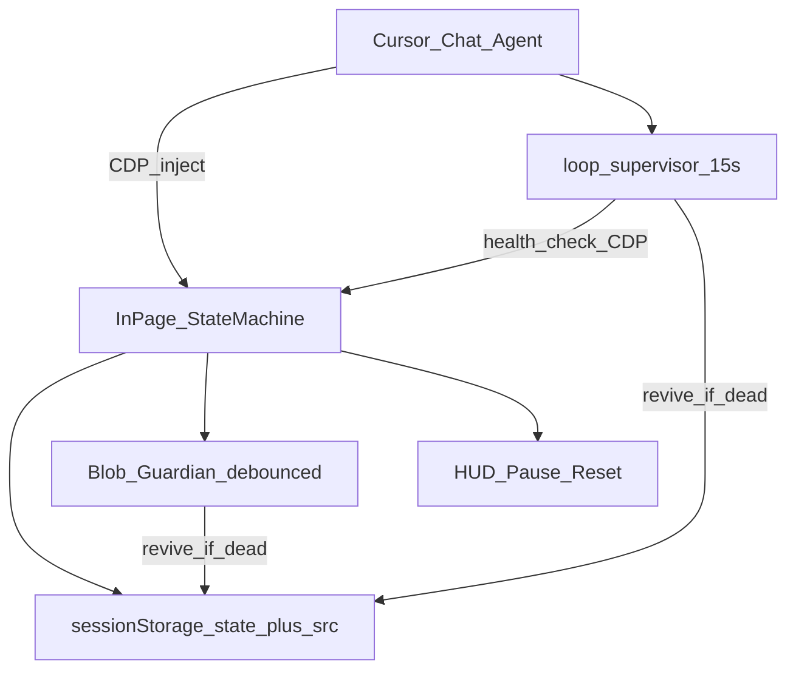

# Architecture

Arquitectura **agnóstica al dominio**: cualquier recipe bajo `recipes/` usa las mismas capas.

## Capas



1. **Chat agent** — orquesta recipe, CDP, loop.
2. **In-page state machine** — ticks locales; dueña del progreso.
3. **sessionStorage** — estado + source b64 + skip list.
4. **Guardian + heartbeat** — revive local.
5. **Loop supervisor** — red de seguridad externa ~15s.
6. **HUD** — control humano.

## State machine (contrato genérico)

```text
boot → find-work → act → confirm? → wait-settle → find-work
                 ↘ (no work sustained) → next-view / rescan / done
```

Adapta los nombres de fase a tu UI (tabs, páginas, wizards, colas).

| Campo | Rol |
|-------|-----|
| `enabled` | El tick actúa solo si true |
| `_userPaused` | Pause humano; revive no lo ignora |
| `phase` | Paso actual |
| `viewIdx` / equivalentes | Sub-vista, tab, carpeta |
| `done` / `failed` | Contadores de progreso |
| `idleEmpty` | Vacíos sostenidos antes de avanzar |
| `rescanRound` | Pasadas anti false-done |
| `lastError` / `lastLabel` | Debug corto |

## Convención de storage / globals

Cada recipe elige un prefijo estable, p.ej. `__crmBulk`:

| Key | Tipo |
|-----|------|
| `__<prefix>State` | estado JSON |
| `__<prefix>Src` | source b64 |
| `__<prefix>Skip` | string[] opcional |

Globals sugeridos:

- `window.__<PREFIX>_LOOP__` / `__<PREFIX>_LOOP_ALIVE`
- `window.__<PREFIX>_HB__` / `__<PREFIX>_GUARDIAN__`
- `window.__<PREFIX>_API__` → `{ start, pause, reset, status }`

El skeleton en [templates/recipe/scripts/main.js](../templates/recipe/scripts/main.js) usa placeholders `RECIPE_*` para renombrar al crear la recipe.

## Health probe (CDP)

Una `Runtime.evaluate` + `returnByValue: true`:

```json
{
  "alive": true,
  "url": "https://…",
  "status": { "phase": "find-work", "done": 12, "enabled": true },
  "workItems": ["…"],
  "srcPresent": true
}
```

Revive si:

- `!alive` y no `_userPaused`
- `phase === "done"` pero aún hay `workItems` / badge / cola → false-done
- URL fuera del scope de la recipe → volver
- Modal de confirmación atascado → resolver según la recipe

## Inyección por chunks

1. `window.__w = ''`
2. Concatenar b64 en slices (~3k)
3. `sessionStorage.setItem(SRC_KEY, window.__w)`
4. Blob-load
5. Opcional: boot corto en `Page.addScriptToEvaluateOnNewDocument`

## Loop supervisor

- Intervalo: **15s**
- Sentinel: `AGENT_LOOP_TICK_<recipeId>`
- Ver skill `.cursor/skills/loop-supervisor/SKILL.md`

## Layout

```text
templates/recipe/     ← empezar aquí
recipes/<name>/       ← automatizaciones reales
examples/             ← referencias opcionales, no defaults
```
